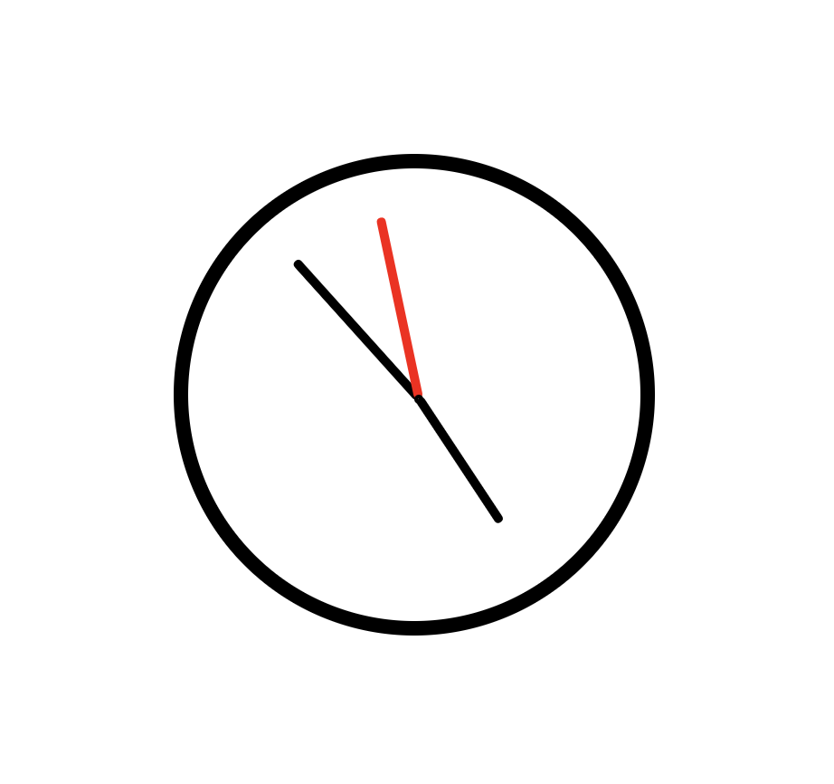

# JS_Project

## 아날로그 시계 만들기

현재 시간을 추출해 아날로그 시계 모양으로 출력하는 코드입니다.

**결과화면**



<br>

### 코드의 대한 설명입니다.

- 현재 시간을 받아옵니다. (시, 분, 초)
- 시간에 따른 각도를 계산합니다.
- 해당 각도로 바늘을 rotate합니다.

```
    if (hour >= 12){
      const DegHour = (hour - 12) * 30 + min * (360 / 12 / 60) // 분을 고려해서 시침이 한번에 움직이지 않게 하기 위함
      const DegMin = min * 6
      const DegSec = sec * 6

      hh.style.transform = `rotate(${DegHour}deg)`;
      mm.style.transform = `rotate(${DegMin}deg)`;
      ss.style.transform = `rotate(${DegSec}deg)`;

    }
```
