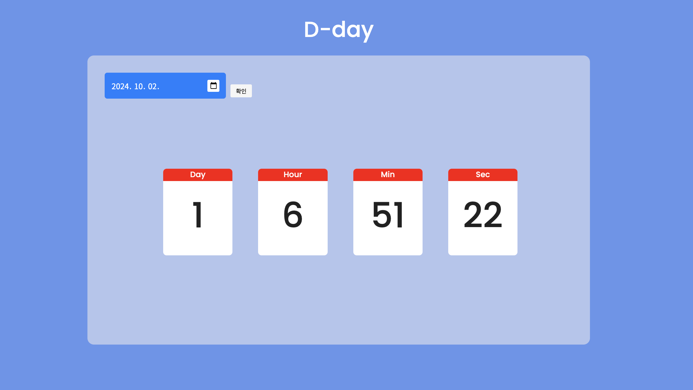

# JS_Project

## 카운트다운 만들기

날짜를 입력받아 얼마나 남았는지 계산해주는 코드입니다. 전역일 계산기를 생각하면서 만들었습니다.

결과화면



<br>

### 코드의 대한 설명입니다.

- 현재 시간과 원하는 시간을 입력 받습니다.
- 원하는 날짜 - 현재 날짜를 밀리초로 환산합니다.
- 1000을 나누어 초로 환산합니다.
- 이와 같은 방법으로 분, 시간, 날짜까지 계산 한 뒤 출력합니다.

```
      const totalSeconds = (EndDate - CurrentDay) / 1000;   // 값이 밀리 초로 나오기 때문에 1000을 나누어 초로 변환
      const days = Math.floor(totalSeconds / 3600 / 24);    // 24로 나눈 몫 = 남은 날짜
      const hours = Math.floor(totalSeconds / 3600) % 24;   // 24로 나눈 나머지 = 남은 시간
      const min = Math.floor(totalSeconds / 60) % 60;
      const sec = Math.floor(totalSeconds) % 60;
```
